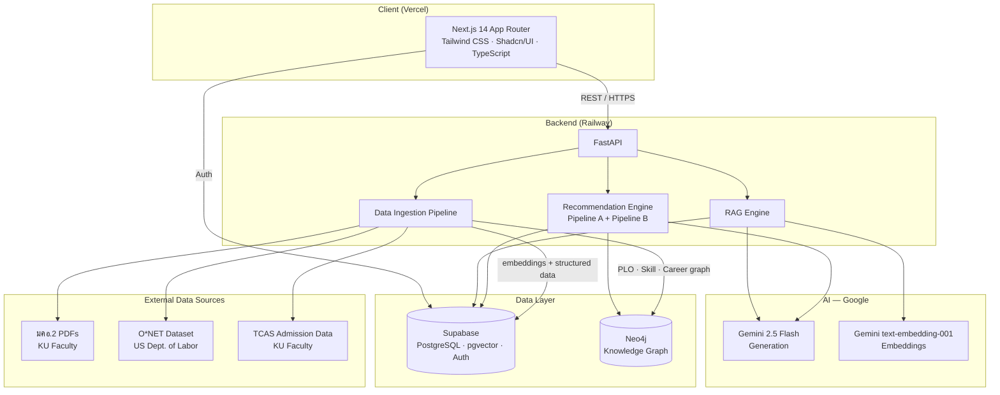
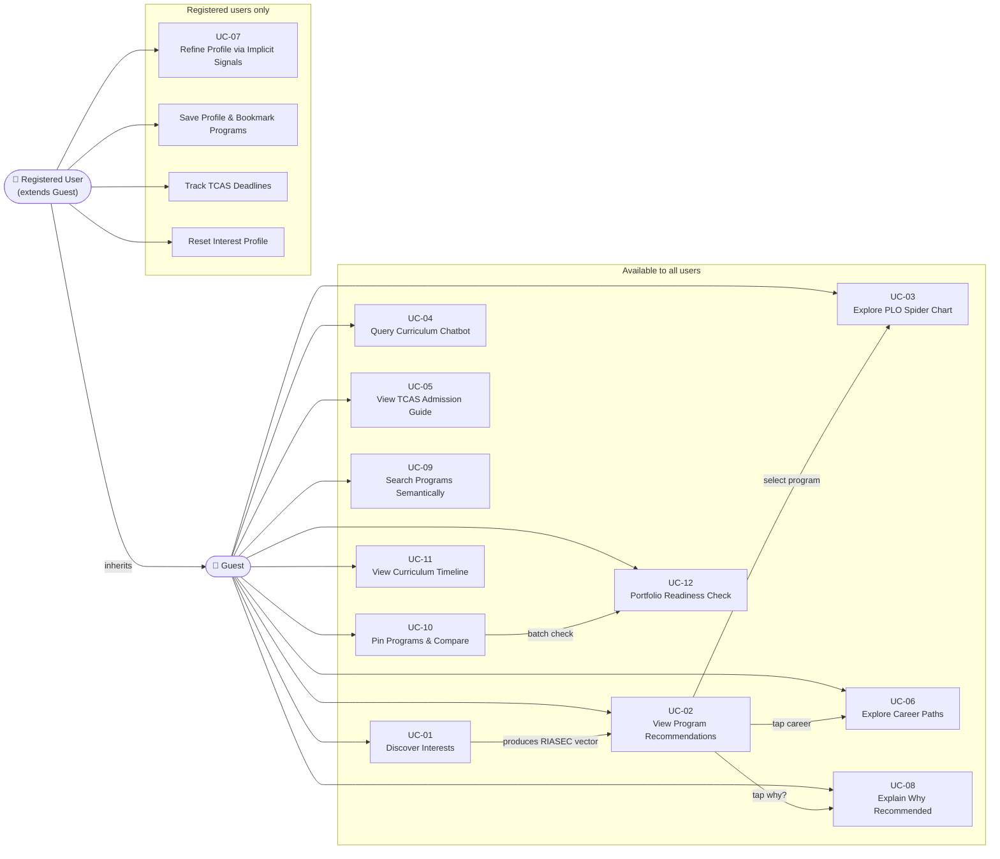
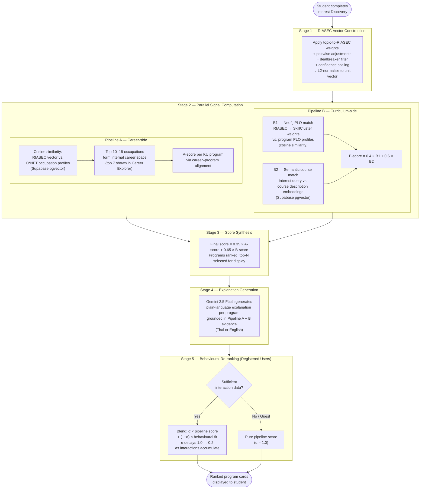
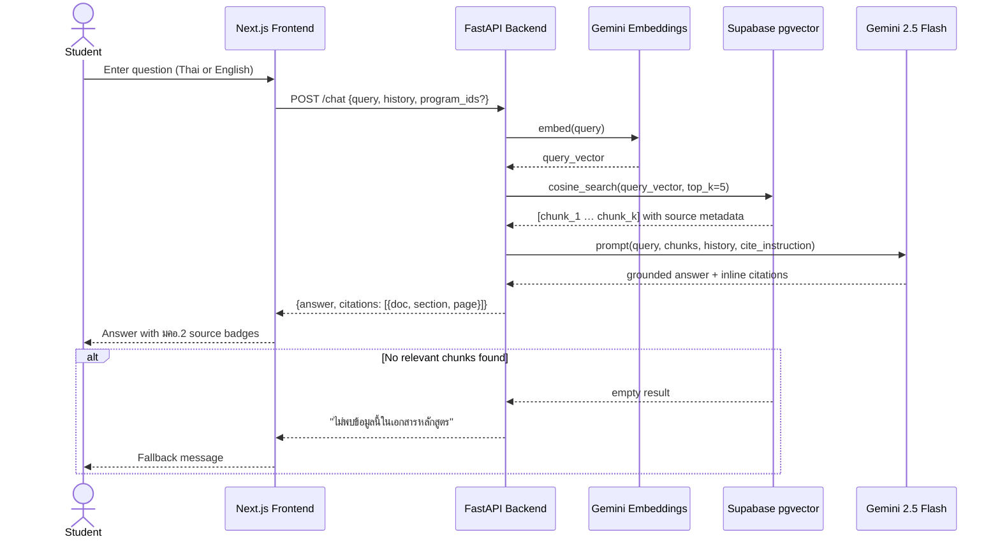

# KUru — Diagram Source

Mermaid source for all figures in the SRS. Render with any Mermaid-compatible viewer
(VS Code Mermaid Preview, mermaid.live, etc.).

---

## Figure 1 — System Architecture (`fig:system-architecture`)

> Three-tier architecture with AI layer. Corresponds to §4.1.

---

## Figure 2 — Use Case Diagram (`fig:use-case-diagram`)

> Actors: Guest and Registered User. Corresponds to §3.3.

---

## Figure 3 — Recommendation Pipeline (`fig:recommendation-pipeline`)

> Five-stage pipeline with two parallel signals. Corresponds to §4.2.2.
> (No current placeholder in the LaTeX — consider adding one to §4.2.2.)

---

## Figure 4 — RAG Pipeline Sequence (`fig:rag-pipeline`)

> Query flow for the Curriculum Chatbot. Corresponds to §4.2.1.
> (No current placeholder in the LaTeX — consider adding one to §4.2.1.)

