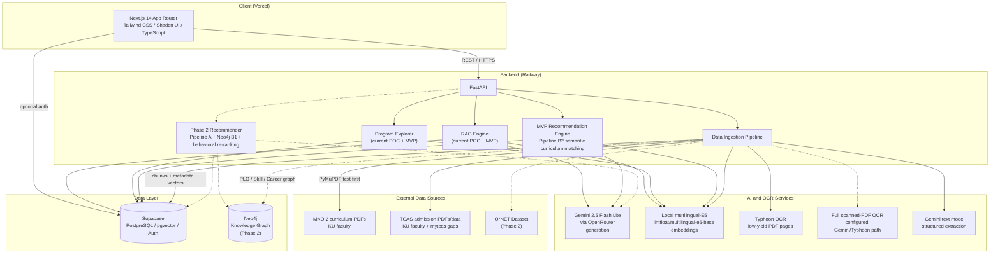
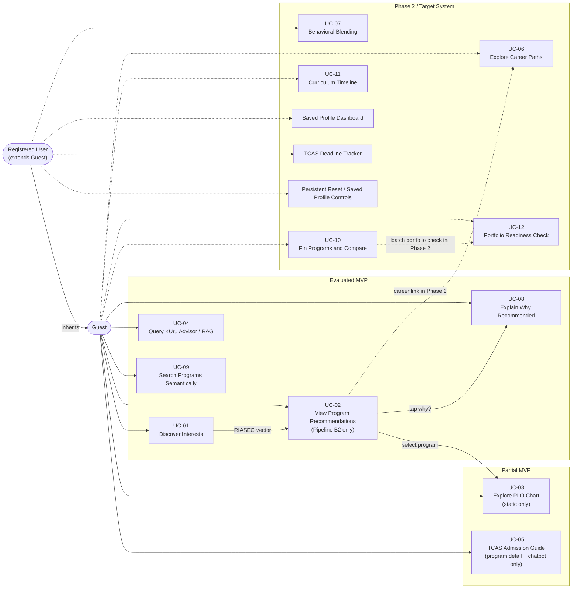
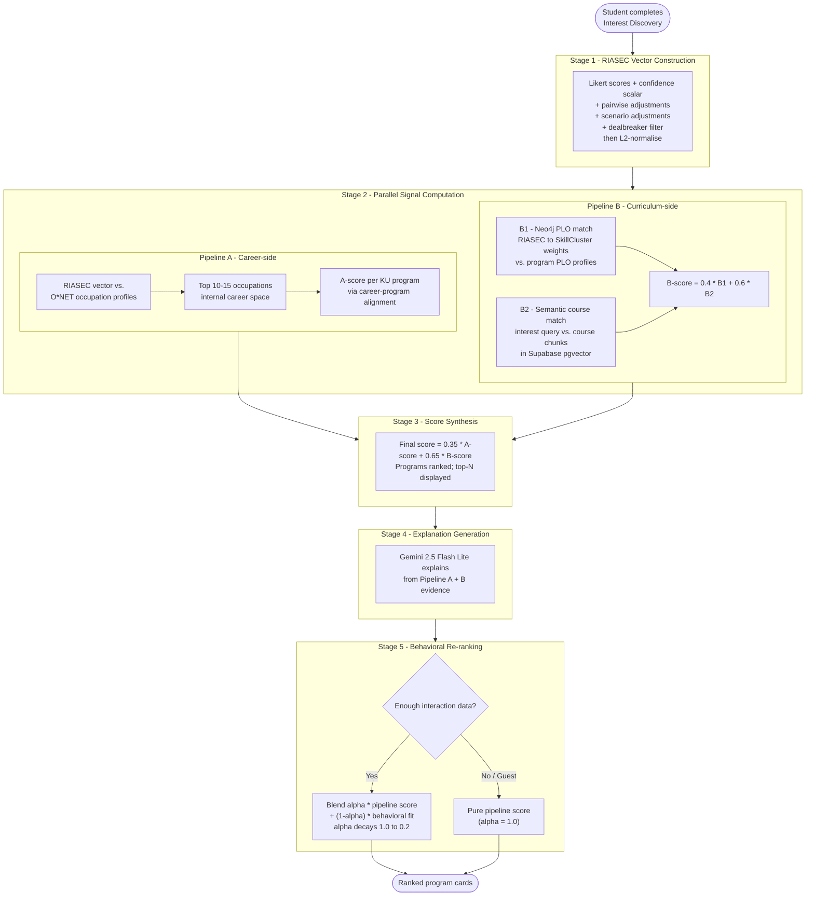
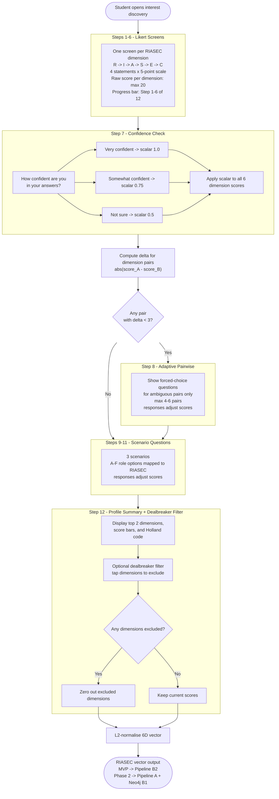
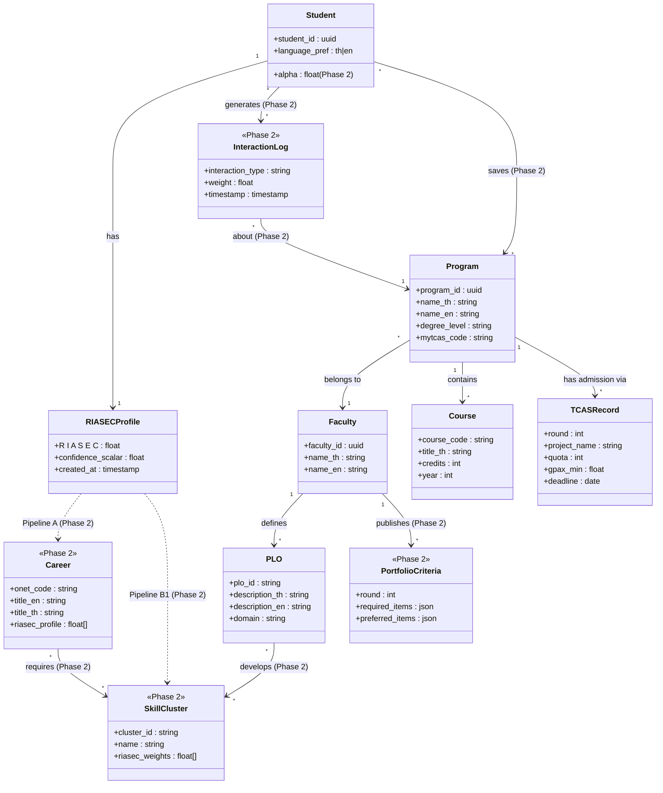

# KUru - Diagram Source

Mermaid source for SRS diagrams. Render with a Mermaid-compatible viewer
(VS Code Mermaid Preview, mermaid.live, or Mermaid CLI).

---

## Figure 1 - System Architecture (`fig:system-architecture`)

> Three-tier architecture with AI/data layer. Current POC includes ingestion, RAG, and Program Explorer. MVP adds Pipeline B2 recommendation. Phase 2 adds graph/career/behavioral features.



---

## Figure 2 - Use Case Diagram (`fig:use-case-diagram`)

> Use cases separated by MVP, partial MVP, and Phase 2.



---

## Figure 3A - MVP Recommendation Pipeline (`fig:mvp-recommendation-pipeline`)

> Evaluated MVP flow. RIASEC becomes curriculum search intent, then matches indexed program/PLO/course chunks. No O*NET, Neo4j B1, or behavioral re-ranking in MVP.

```mermaid
flowchart TD
    START(["Student completes<br/>RIASEC interest discovery"])

    subgraph PROFILE["1. Build Interest Profile"]
        VEC["6D RIASEC vector<br/>R / I / A / S / E / C"]
        TOP["Top dimensions / Holland code<br/>example: Investigative + Realistic"]
        START --> VEC --> TOP
    end

    subgraph INTENT["2. Convert RIASEC to Curriculum Search Intent"]
        THEMES["Map dimensions to interest themes<br/>analysis, systems, design,<br/>experiments, hands-on work"]
        QUERY["Create semantic query<br/>from themes + answers"]
        TOP --> THEMES --> QUERY
    end

    subgraph RETRIEVAL["3. Pipeline B2: Semantic Curriculum Matching"]
        EMB["Local multilingual-E5<br/>embed semantic query"]
        PGV[("Supabase pgvector<br/>program + PLO + course chunks")]
        CHUNKS["Retrieve matching chunks<br/>with program_id + source metadata"]
        QUERY --> EMB --> PGV --> CHUNKS
    end

    subgraph SCORING["4. Program Scoring"]
        GROUP["Group chunks by program"]
        SCORE["Compute curriculum-fit score<br/>top-k similarity average<br/>+ section weighting<br/>+ theme coverage"]
        RANK["Rank programs by score"]
        CHUNKS --> GROUP --> SCORE --> RANK
    end

    subgraph EXPLAIN["5. Evidence-Grounded Explanation"]
        EVIDENCE["Select strongest evidence<br/>PLOs, course descriptions,<br/>projects, labs, admission info if relevant"]
        GEMINI["Gemini 2.5 Flash Lite<br/>via OpenRouter<br/>explain only from evidence"]
        CARDS["Ranked program cards<br/>with explanation"]
        RANK --> EVIDENCE --> GEMINI --> CARDS
    end

    NOTE["MVP evaluation: short-term relevance<br/>advisor/senior-student labels,<br/>curriculum evidence, MRR, NDCG@5,<br/>explanation faithfulness.<br/>No 4-year satisfaction claim."]
    CARDS --> NOTE
```



---

## Figure 3B - Phase 2 Target-System Recommendation Pipeline (`fig:recommendation-pipeline`)

> Five-stage target-system design. This is not the evaluated MVP flow.



---

## Figure 4 - RAG Pipeline Sequence (`fig:rag-pipeline`)

> Current MVP/POC query flow for the KUru Advisor chatbot.

```mermaid
sequenceDiagram
    actor Student
    participant FE as Next.js Frontend
    participant API as FastAPI Backend
    participant EMB as Local E5 Embedder
    participant PGV as Supabase pgvector
    participant LLM as Gemini 2.5 Flash Lite

    Student->>FE: Enter question (Thai or English)
    FE->>API: POST /chat {query, history, program_id?}
    API->>EMB: embed(query)
    EMB-->>API: query_vector
    API->>PGV: cosine_search(query_vector, top_k=5, min_similarity=0.35)
    PGV-->>API: chunks with source metadata
    API->>LLM: prompt(query, chunks, history, cite_instruction)
    LLM-->>API: grounded answer + inline citations
    API-->>FE: answer + citations(source_file, section_type, similarity)
    FE-->>Student: answer with provenance chips
    Note over FE,Student: Current chips are not clickable;<br/>chunk preview / PDF-page opening is Phase 2

    alt No relevant chunks found
        PGV-->>API: empty result
        API-->>FE: "This information was not found in the curriculum document."
        FE-->>Student: fallback message
    end
```

---

## Figure 5 - Interest Elicitation Flow (`fig:elicitation-flow`)

> UC-01 adaptive 12-step process.



---

## Figure 6 - Domain Model (`fig:domain-model`)

> Core business entities. Phase 2 entities and relationships are explicitly labelled.


